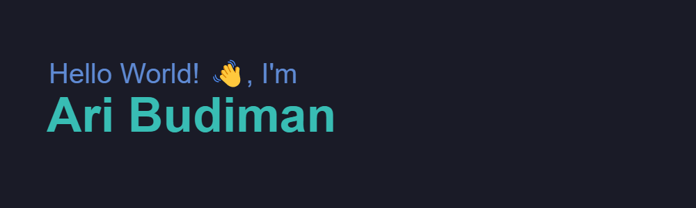

An independent Programmer who loves to create and share projects about web application technology! I've enjoyed PHP & JavaScript and make it the main language in creating a project. My speciality is Laravel Framework.

- 🔭 I’m currently working on software house, and take freelancer for request create website 
- 🌱 I’m currently learning about cloud technology for back-end apps
- 💬 Feel free to ask me about web development or JavaScript and PHP
- 📫 How to reach me: iaid.aribudiman@gmail.com
- ⚡ Fun fact: I love playing games and watch Anime

### Tech Stack
<a href="https://github.com/rhyman18">
  
  
  
  
  
  
  
  
  
  
  
  <!--  -->
  <!--  -->
  <!--  -->
  
  
  
  
  
</a>
 
  
### Github Statistic

  

### Reach me on
- <a href="https://www.aribudiman.my.id">Portofolio Website</a>
- <a href="https://linkedin.com/in/rhyman18/">LinkedIn</a>
- iaid.aribudiman@gmail.com
- <a href="https://facebook.com/rhyman18">Facebook</a>
- <a href="https://twitter.com/rhyman18">Twitter</a>
